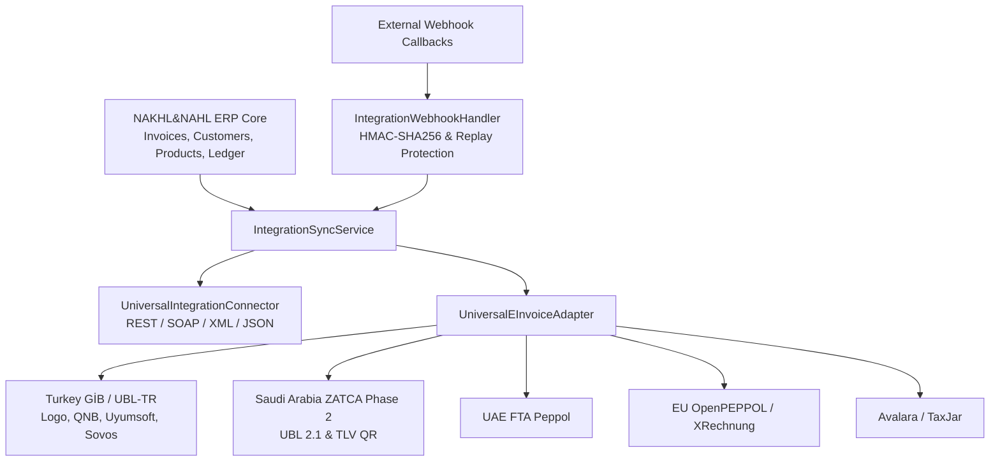

# NAKHL&NAHL Universal Integration Architecture

## 1. Executive Summary & Vision

The **Universal Integration Architecture (UIA)** in NAKHL&NAHL is an enterprise-grade, country-agnostic and provider-independent interoperability platform. Rather than binding core ERP modules directly to specific regional tax authorities (such as GİB in Turkey or ZATCA in Saudi Arabia), NAKHL&NAHL implements an abstraction layer that treats all external electronic document authorities, ERPs, accounting suites, POS systems, payment gateways, and logistics providers uniformly.

---

## 2. Core Architectural Pillars

### 2.1 Dynamic Country & Provider Registry
- **Database Table:** `integration_provider_registry`
- **Model:** `CountryIntegrationProfile`
- **Capability:** Decouples regional fiscal requirements (e.g. currency, tax rates, e-invoice mandates, clearance vs reporting workflows, cryptographic signatures) into database-driven schemas. Adding a new country (e.g. Germany XRechnung or UAE FTA) requires zero modifications to invoice generation or sales pipelines.

### 2.2 Universal Integration Connector
- **Service:** `UniversalIntegrationConnector`
- **Supported Protocols:** REST, SOAP/XML, JSON, Webhook callbacks, mutual TLS (mTLS) client certificates.
- **Enterprise Resilience:**
  - Configurable timeouts (default 30s)
  - Automatic exponential backoff retries with jitter
  - Deterministic idempotency (`Idempotency-Key` HTTP headers)
  - Traceable distributed correlation (`X-Correlation-ID`)
  - Normalized error hierarchy via `IntegrationException` and `IntegrationErrorCode`.

### 2.3 Universal E-Invoice Adapter
- **Service:** `UniversalEInvoiceAdapter`
- **Interface Methods:**
  - `submitInvoice(InvoiceExportModel invoice)`
  - `validateInvoice(InvoiceExportModel invoice)`
  - `getInvoiceStatus(String remoteInvoiceId)`
  - `cancelInvoice(String remoteInvoiceId, String reason)`
  - `generateDocumentXml(InvoiceExportModel invoice)`
  - `parseIncomingDocument(String rawXmlOrJson)`
  - `validateTaxIdentity(String taxId, CountryCode country)`

### 2.4 Bidirectional ERP Mapping & Sync Engine
- **Service:** `IntegrationSyncService`
- **Database Table:** `integration_entity_mappings`
- **Entity Coverage:** Customers, Suppliers, Products, Invoices, Payments, Journal Entries.
- **Conflict Strategy:** Last-write-wins with cryptographic hash verification (`sync_hash`) to avoid duplicate processing.

---

## 3. Security & Multi-Tenant Isolation
1. **Forced RLS:** Every integration configuration (`integration_configs`) and entity mapping (`integration_entity_mappings`) contains `tenant_id` and is guarded by PostgreSQL Row-Level Security policies.
2. **Encrypted Secret Storage:** API keys, CSID private keys, client secrets, and passwords are never displayed in plaintext in the UI or serialized into client logs.
3. **Environment Segregation:** Strict partition between `SANDBOX` and `PRODUCTION` profiles. Production toggles require live credential health verification.
